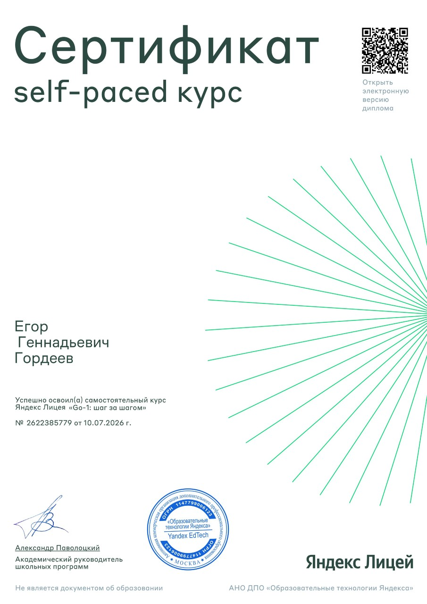

# 🚀 EgorGo-dev — Мои решения задач по Go

Здесь я храню решения задач по Go из **Яндекс Лицея** и других источников. Репозиторий показывает мой прогресс в изучении языка, владение Git и GitHub.

---

## 👨‍💻 Обо мне

- Начал программировать в **13 лет** с C++.
- Через год перешёл на **Go** — он такой же быстрый, но проще и приятнее.
- Учусь в **Яндекс Лицее** (курс «Go-2: шаг за шагом»).
- 🥇 **Занял 1 место** на курсе «Go-1: шаг за шагом» в Яндекс Лицее.
- Уже решил **более 100 задач** на Go.
- Интересуюсь бэкенд-разработкой, высоконагруженными системами и облачными технологиями.
- Всегда открыт к обсуждению кода и новым идеям.

---

## 🛠 Стек

**Go** · Git · GitHub · VS Code · `fmt` · `time` · `strings` · `errors` · `slices` · `io` · `os` · `unicode/utf8` · `bytes` · `sync` · `context` · `net/http` · `testing` · `math`

---

## 📝 Решённые задачи

### ✅ Контрольные работы и сложные задачи

- [Задача 1](./work/task1/task1.md) — решение: [task1.go](./work/task1/task1.go)
- [Задача 2](./work/task2/task2.md) — решение: [task2.go](./work/task2/task2.go)
- [Задача 3](./work/task3/task3.md) — решение: [task3.go](./work/task3/task3.go)
- [Задача 4](./work/task4/task4.md) — решение: [task4.go](./work/task4/task4.go)
- [Задача 5](./work/task5/task5.md) — решение: [task5.go](./work/task5/task5.go)
- [Задача 6](./work/task6/task6.md) — решение: [task6.go](./work/task6/task6.go)
- [Задача 7](./work/task7/task7.md) — решение: [task7.go](./work/task7/task7.go)
- [Задача 8](./work/task8/task8.md) — решение: [task8.go](./work/task8/task8.go)
- [Задача 9](./work/task9/task9.md) — решение: [task9.go](./work/task9/task9.go)
- [Задача 10](./work/task10/task10.md) — решение: [task10.go](./work/task10/task10.go)
- [Задача 11](./work/task11/task11.md) — решение: [task11.go](./work/task11/task11.go)
- [Задача 12](./work/task12/task12.md) — решение: [task12.go](./work/task12/task12.go)

### 📌 Мелкие задачи

Решено **более 100** небольших задач на Go: циклы, условия, функции, строки, массивы, слайсы, мапы, структуры, методы, конструкторы, интерфейсы, ошибки, тестирование и другое.  
*(Они не выложены отдельно, чтобы не загромождать репозиторий.)*

---

## 🏆 Сертификат

  

*Сертификат об успешном завершении курса «Go-1 шаг за шагом» в Яндекс Лицее.*

---

## 📬 Контакты

- GitHub: [EgorGo-dev](https://github.com/EgorGo-dev)
- Email: `gpp220512@gmail.com`

---

⭐ Если этот репозиторий показался вам полезным — поставьте звёздочку!  
Спасибо, что заглянули! 😊