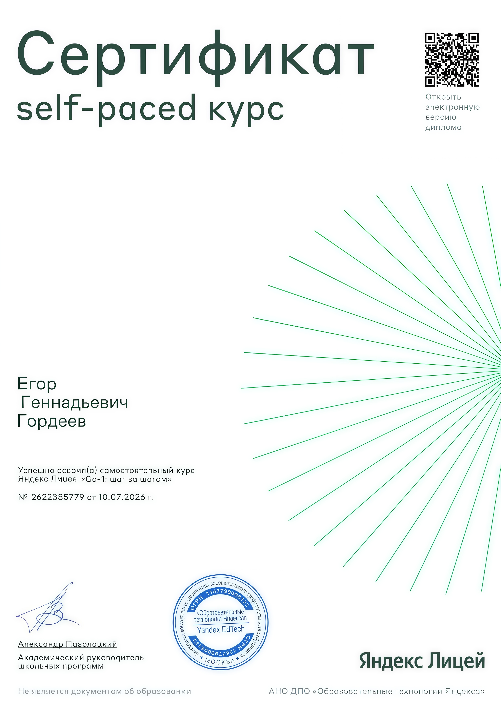

# 🚀 EgorGo-dev — Мои решения задач по Go

Здесь я храню решения задач по Go из **Яндекс Лицея** и других источников. Репозиторий показывает мой прогресс в изучении языка, владение Git и GitHub.

---

## 👨‍💻 Обо мне

- Мне **14** лет.
- Начал программировать в **13 лет** с C++.
- Через год перешёл на **Go** — он такой же быстрый, но проще и приятнее.
- Учусь в **Яндекс Лицее** (сейчас на курсе «Веб-разработка на Go»).  
- 🥇 **Занял 1 место** на курсах: **Go-1**, **Go-2**, **Go-3** и **SQL** в Яндекс Лицее.  
- Уже решил **более 200 задач** на Go.
- Активно изучаю **SQL (SQLite/PostgreSQL)** и решаю задачи по запросам, проектированию таблиц и работе с данными.
- 🚀 Интересуюсь бэкенд-разработкой, высоконагруженными системами и облачными технологиями.
- Всегда открыт к обсуждению кода и новым идеям.

---

## 🛠 Стек

**Языки и технологии:** Go · SQLite · PostgreSQL  
**Инструменты:** Git · GitHub · VS Code  
**Пакеты Go:** `fmt` · `time` · `strings` · `strconv` · `log` · `log/slog` · `errors` · `slices` · `io` · `runtime/pprof` · `os` · `unicode/utf8` · `go.uber.org/zap` · `encoding/json` · `reflect` · `bytes` · `sync` · `regexp` · `context` · `net/url` · `net/http` · `net/http/httptest` · `testing` · `math`

---

## 📝 Решённые задачи

<b>📋 Контрольные работы и сложные задачи</b> (нажмите, чтобы развернуть)

| Задачи 1–30 | Задачи 31–60 | Задачи 61–90 |
|-------------|--------------|--------------|
| &nbsp;1.&nbsp;&nbsp;📄 [условие](./work/task1/task1.md) 💻 [Go-решение](./work/task1/task1.go) | 31.&nbsp;📄 [условие](./work/task31/task31.md) 💻&nbsp;[Go-решение](./work/task31/task31.go) | 61.&nbsp;📄 [условие](./work/task61/task61.md) 🗄️ [SQL-решение](./work/task61/task61.sql) |
| &nbsp;2.&nbsp;&nbsp;📄 [условие](./work/task2/task2.md) 💻 [Go-решение](./work/task2/task2.go) | 32.&nbsp;📄 [условие](./work/task32/task32.md) 💻&nbsp;[Go-решение](./work/task32/task32.go) | 62.&nbsp;📄 [условие](./work/task62/task62.md) 🗄️ [SQL-решение](./work/task62/task62.sql) |
| &nbsp;3.&nbsp;&nbsp;📄 [условие](./work/task3/task3.md) 💻 [Go-решение](./work/task3/task3.go) | 33.&nbsp;📄 [условие](./work/task33/task33.md) 💻&nbsp;[Go-решение](./work/task33/task33.go) | 63.&nbsp;📄 [условие](./work/task63/task63.md) 🗄️ [SQL-решение](./work/task63/task63.sql) |
| &nbsp;4.&nbsp;&nbsp;📄 [условие](./work/task4/task4.md) 💻 [Go-решение](./work/task4/task4.go) | 34.&nbsp;📄 [условие](./work/task34/task34.md) 💻&nbsp;[Go-решение](./work/task34/task34.go) | 64.&nbsp;📄 [условие](./work/task64/task64.md) 🗄️ [SQL-решение](./work/task64/task64.sql) |
| &nbsp;5.&nbsp;&nbsp;📄 [условие](./work/task5/task5.md) 💻 [Go-решение](./work/task5/task5.go) | 35.&nbsp;📄 [условие](./work/task35/task35.md) 💻&nbsp;[Go-решение](./work/task35/task35.go) | 65.&nbsp;📄 [условие](./work/task65/task65.md) 🗄️ [SQL-решение](./work/task65/task65.sql) |
| &nbsp;6.&nbsp;&nbsp;📄 [условие](./work/task6/task6.md) 💻 [Go-решение](./work/task6/task6.go) | 36.&nbsp;📄 [условие](./work/task36/task36.md) 💻&nbsp;[Go-решение](./work/task36/task36.go) | 66.&nbsp;📄 [условие](./work/task66/task66.md) 🗄️ [SQL-решение](./work/task66/task66.sql) |
| &nbsp;7.&nbsp;&nbsp;📄 [условие](./work/task7/task7.md) 💻 [Go-решение](./work/task7/task7.go) | 37.&nbsp;📄 [условие](./work/task37/task37.md) 🗄️ [SQL-решение](./work/task37/task37.sql) | 67.&nbsp;📄 [условие](./work/task67/task67.md) 🗄️ [SQL-решение](./work/task67/task67.sql) |
| &nbsp;8.&nbsp;&nbsp;📄 [условие](./work/task8/task8.md) 💻 [Go-решение](./work/task8/task8.go) | 38.&nbsp;📄 [условие](./work/task38/task38.md) 🗄️ [SQL-решение](./work/task38/task38.sql) | 68.&nbsp;📄 [условие](./work/task68/task68.md) 🗄️ [SQL-решение](./work/task68/task68.sql) |
| &nbsp;9.&nbsp;&nbsp;📄 [условие](./work/task9/task9.md) 💻 [Go-решение](./work/task9/task9.go) | 39.&nbsp;📄 [условие](./work/task39/task39.md) 🗄️ [SQL-решение](./work/task39/task39.sql) | 69.&nbsp;📄 [условие](./work/task69/task69.md) 🗄️ [SQL-решение](./work/task69/task69.sql) |
| 10.&nbsp;📄 [условие](./work/task10/task10.md) 💻 [Go-решение](./work/task10/task10.go) | 40.&nbsp;📄 [условие](./work/task40/task40.md) 🗄️ [SQL-решение](./work/task40/task40.sql) | 70.&nbsp;📄 [условие](./work/task70/task70.md) 🗄️ [SQL-решение](./work/task70/task70.sql) |
| 11.&nbsp;📄 [условие](./work/task11/task11.md) 💻 [Go-решение](./work/task11/task11.go) | 41.&nbsp;📄 [условие](./work/task41/task41.md) 🗄️ [SQL-решение](./work/task41/task41.sql) | 71.&nbsp;📄 [условие](./work/task71/task71.md) 🗄️ [SQL-решение](./work/task71/task71.sql) |
| 12.&nbsp;📄 [условие](./work/task12/task12.md) 💻 [Go-решение](./work/task12/task12.go) | 42.&nbsp;📄 [условие](./work/task42/task42.md) 🗄️ [SQL-решение](./work/task42/task42.sql) | 72.&nbsp;📄 [условие](./work/task72/task72.md) 🗄️ [SQL-решение](./work/task72/task72.sql) |
| 13.&nbsp;📄 [условие](./work/task13/task13.md) 💻 [Go-решение](./work/task13/task13.go) | 43.&nbsp;📄 [условие](./work/task43/task43.md) 🗄️ [SQL-решение](./work/task43/task43.sql) | 73.&nbsp;📄 [условие](./work/task73/task73.md) 🗄️ [SQL-решение](./work/task73/task73.sql) |
| 14.&nbsp;📄 [условие](./work/task14/task14.md) 💻 [Go-решение](./work/task14/task14.go) | 44.&nbsp;📄 [условие](./work/task44/task44.md) 🗄️ [SQL-решение](./work/task44/task44.sql) | 74.&nbsp;📄 [условие](./work/task74/task74.md) 🗄️ [SQL-решение](./work/task74/task74.sql) |
| 15.&nbsp;📄 [условие](./work/task15/task15.md) 💻 [Go-решение](./work/task15/task15.go) | 45.&nbsp;📄 [условие](./work/task45/task45.md) 🗄️ [SQL-решение](./work/task45/task45.sql) | 75.&nbsp;📄 [условие](./work/task75/task75.md) 🗄️ [SQL-решение](./work/task75/task75.sql) |
| 16.&nbsp;📄 [условие](./work/task16/task16.md) 💻 [Go-решение](./work/task16/task16.go) | 46.&nbsp;📄 [условие](./work/task46/task46.md) 🗄️ [SQL-решение](./work/task46/task46.sql) | 76.&nbsp;📄 [условие](./work/task76/task76.md) 🗄️ [SQL-решение](./work/task76/task76.sql) |
| 17.&nbsp;📄 [условие](./work/task17/task17.md) 💻 [Go-решение](./work/task17/task17.go) | 47.&nbsp;📄 [условие](./work/task47/task47.md) 🗄️ [SQL-решение](./work/task47/task47.sql) | 77.&nbsp;📄 [условие](./work/task77/task77.md) 🗄️ [SQL-решение](./work/task77/task77.sql) |
| 18.&nbsp;📄 [условие](./work/task18/task18.md) 💻 [Go-решение](./work/task18/task18.go) | 48.&nbsp;📄 [условие](./work/task48/task48.md) 🗄️ [SQL-решение](./work/task48/task48.sql) | 78.&nbsp;📄 [условие](./work/task78/task78.md) 🗄️ [SQL-решение](./work/task78/task78.sql) |
| 19.&nbsp;📄 [условие](./work/task19/task19.md) 💻 [Go-решение](./work/task19/task19.go) | 49.&nbsp;📄 [условие](./work/task49/task49.md) 🗄️ [SQL-решение](./work/task49/task49.sql) | 79.&nbsp;📄 [условие](./work/task79/task79.md) 🗄️ [SQL-решение](./work/task79/task79.sql) |
| 20.&nbsp;📄 [условие](./work/task20/task20.md) 💻 [Go-решение](./work/task20/task20.go) | 50.&nbsp;📄 [условие](./work/task50/task50.md) 🗄️ [SQL-решение](./work/task50/task50.sql) | 80.&nbsp;📄 [условие](./work/task80/task80.md) 🗄️ [SQL-решение](./work/task80/task80.sql) |
| 21.&nbsp;📄 [условие](./work/task21/task21.md) 💻 [Go-решение](./work/task21/task21.go) | 51.&nbsp;📄 [условие](./work/task51/task51.md) 🗄️ [SQL-решение](./work/task51/task51.sql) | 81.&nbsp;📄 [условие](./work/task81/task81.md) 🗄️ [SQL-решение](./work/task81/task81.sql) |
| 22.&nbsp;📄 [условие](./work/task22/task22.md) 💻 [Go-решение](./work/task22/task22.go) | 52.&nbsp;📄 [условие](./work/task52/task52.md) 🗄️ [SQL-решение](./work/task52/task52.sql) | 82.&nbsp;📄 [условие](./work/task82/task82.md) 🗄️ [SQL-решение](./work/task82/task82.sql) |
| 23.&nbsp;📄 [условие](./work/task23/task23.md) 💻 [Go-решение](./work/task23/task23.go) | 53.&nbsp;📄 [условие](./work/task53/task53.md) 🗄️ [SQL-решение](./work/task53/task53.sql) | 83.&nbsp;📄 [условие](./work/task83/task83.md) 🗄️ [SQL-решение](./work/task83/task83.sql) |
| 24.&nbsp;📄 [условие](./work/task24/task24.md) 💻 [Go-решение](./work/task24/task24.go) | 54.&nbsp;📄 [условие](./work/task54/task54.md) 🗄️ [SQL-решение](./work/task54/task54.sql) | 84.&nbsp;📄 [условие](./work/task84/task84.md) 🗄️ [SQL-решение](./work/task84/task84.sql) |
| 25.&nbsp;📄 [условие](./work/task25/task25.md) 💻 [Go-решение](./work/task25/task25.go) | 55.&nbsp;📄 [условие](./work/task55/task55.md) 🗄️ [SQL-решение](./work/task55/task55.sql) | 85.&nbsp;📄 [условие](./work/task85/task85.md) 🗄️ [SQL-решение](./work/task85/task85.sql) |
| 26.&nbsp;📄 [условие](./work/task26/task26.md) 💻 [Go-решение](./work/task26/task26.go) | 56.&nbsp;📄 [условие](./work/task56/task56.md) 🗄️ [SQL-решение](./work/task56/task56.sql) | 86.&nbsp;📄 [условие](./work/task86/task86.md) 🗄️ [SQL-решение](./work/task86/task86.sql) |
| 27.&nbsp;📄 [условие](./work/task27/task27.md) 💻 [Go-решение](./work/task27/task27.go) | 57.&nbsp;📄 [условие](./work/task57/task57.md) 🗄️ [SQL-решение](./work/task57/task57.sql) | 87.&nbsp;📄 [условие](./work/task87/task87.md) 🗄️ [SQL-решение](./work/task87/task87.sql) |
| 28.&nbsp;📄 [условие](./work/task28/task28.md) 💻 [Go-решение](./work/task28/task28.go) | 58.&nbsp;📄 [условие](./work/task58/task58.md) 🗄️ [SQL-решение](./work/task58/task58.sql) | 88.&nbsp;📄 [условие](./work/task88/task88.md) 🗄️ [SQL-решение](./work/task88/task88.sql) |
| 29.&nbsp;📄 [условие](./work/task29/task29.md) 💻 [Go-решение](./work/task29/task29.go) | 59.&nbsp;📄 [условие](./work/task59/task59.md) 🗄️ [SQL-решение](./work/task59/task59.sql) | 89.&nbsp;📄 [условие](./work/task89/task89.md) 🗄️ [SQL-решение](./work/task89/task89.sql) |
| 30.&nbsp;📄 [условие](./work/task30/task30.md) 💻 [Go-решение](./work/task30/task30.go) | 60.&nbsp;📄 [условие](./work/task60/task60.md) 🗄️ [SQL-решение](./work/task60/task60.sql) | 90.&nbsp;📄 [условие](./work/task90/task90.md) 🗄️ [SQL-решение](./work/task90/task90.sql) |

 

<b>💀🔥 Сверхсложные задачи — БОСС-УРОВЕНЬ</b> (нажмите, чтобы развернуть)

> ⚠️ **Внимание!** Эти задачи требуют нестандартного мышления, глубокого понимания **Go** 💻 или **SQL (SQLite)** 🗄️ и железных нервов.  
> Подходите с осторожностью – здесь не место для слабаков! ⚔️

| ⚡ Задача | 📄 Условие | 💻/🗄️ Решение | 📌 Язык | 🧠 Сложность |
|-----------|------------|----------------|---------|--------------|
| **1.** | 📄 [условие](./work/HARDtask1/hardTask.md) | 💻 [решение](./work/HARDtask1/hardTask.go) | **Go** | 🧠🧠🧠 |
| **2.** | 📄 [условие](./work/HARDtask2/hardTask2.md) | 🗄️ [решение](./work/HARDtask2/hardTask2.sql) | **SQL** | 🧠 |
| **3.** | 📄 [условие](./work/HARDtask3/hardTask3.md) | 🗄️ [решение](./work/HARDtask3/hardTask3.sql) | **SQL** | 🧠🧠🧠🧠 |
| **4.** | — | — | — | — |
| **5.** | — | — | — | — |

 

<b>📌 Мелкие задачи</b> (нажмите, чтобы развернуть)

Решено **более 150** небольших задач на **Go** и **SQL (SQLite + PostgreSQL)**:

**Go:**  
`циклы`, `условия`, `функции`, `строки`, `массивы`, `слайсы`, `мапы`, `структуры`, `методы`, `конструкторы`, `интерфейсы`, `ошибки`, `тестирование`, **горутины**, **каналы**, **синхронизация** (`sync.Mutex`, `sync.WaitGroup`), **контекст** (`context`), **тестирование конкурентного кода** (`go test -race`).

**SQL (общие темы для SQLite и PostgreSQL):**  
- **Основы:** `SELECT`, `FROM`, `AS`, `WHERE`, `AND`, `OR`, `NOT`, `IN`, `NOT IN`, `BETWEEN`, `LIKE`, `IS NULL`, `IS NOT NULL`, `ORDER BY`, `LIMIT`, `OFFSET`, `DISTINCT`.  
- **Агрегация:** `COUNT`, `SUM`, `AVG`, `MIN`, `MAX`, `GROUP BY`, `HAVING`.  
- **Строки:** `||`, `LENGTH`, `LOWER`, `UPPER`, `SUBSTR` (в SQLite) / `SUBSTRING` (в PostgreSQL), `POSITION`.  
- **Округление и преобразование:** `ROUND`, `CAST`.  
- **Условная логика:** `CASE WHEN`.  
- **Подзапросы:** скалярные, `IN`, `EXISTS`, `NOT EXISTS`, подзапросы в `FROM`.  
- **Соединения:** `INNER JOIN`, `LEFT JOIN`, `SELF JOIN`.  
- **CTE:** `WITH ... AS`, несколько CTE.  
- **Оконные функции:** `ROW_NUMBER`, `RANK`, `DENSE_RANK`, `SUM() OVER`, `AVG() OVER`, `LAG`, `LEAD`, `PARTITION BY`, `ORDER BY` в окне.  
- **Временные таблицы.**

**Специфическое для SQLite:**  
- Даты: `strftime`, `JULIANDAY`.  
- Ограничения: `LIMIT`/`OFFSET` (работает чуть иначе, чем в PostgreSQL).

**Специфическое для PostgreSQL:**  
- Даты: `EXTRACT`, `to_char`, `NOW()`.  
- Генерация ID: `SERIAL`, `BIGSERIAL`.  
- Возврат данных: `RETURNING`.  
- Тип данных: `JSONB`.  
- Работа с дубликатами, выбор максимума через подзапросы, ранжирование внутри групп.

*(Я не выложил их отдельно, потому что их очень много.)*

---

## 🏆 Сертификаты

| 🏆 Go-1 | 🏆 Go-2 | 🏆 Go-3 |
|---------|---------|---------|
|    **Егор Геннадьевич Гордеев**   self-paced курс |    **Егор Геннадьевич Гордеев**   self-paced курс |    **Егор Геннадьевич Гордеев**   self-paced курс |
| 
🏆 **SQL**
 | 
🏆 **Математическое мышление**
 | 
🏆 **Веб-разработка на Go** (планируется)
 |
|    **Егор Геннадьевич Гордеев**   self-paced курс |    **Егор Геннадьевич Гордеев**   self-paced курс | 
*Планируется*
 |
| 
🏆 **PostgreSQL** (планируется)
 | 
🏆 **Скоро**
 | 
🏆 **Скоро**
 |
| 
*Планируется*
 | 
*Скоро*
 | 
*Скоро*
 |

*Сертификаты об успешном завершении курсов «Go-1 шаг за шагом», «Go-2 шаг за шагом», «Go-3 шаг за шагом», «SQL: шаг за шагом», «Математическое мышление для программистов» и планируемых курсах «Веб-разработка на Go» и «PostgreSQL» в Яндекс Лицее.*

---

## 📬 Контакты

- GitHub: [EgorGo-dev](https://github.com/EgorGo-dev)
- Email: `gpp220512@gmail.com`

---

⭐ Если этот репозиторий показался вам полезным — поставьте звёздочку!  
Спасибо, что заглянули! 😊